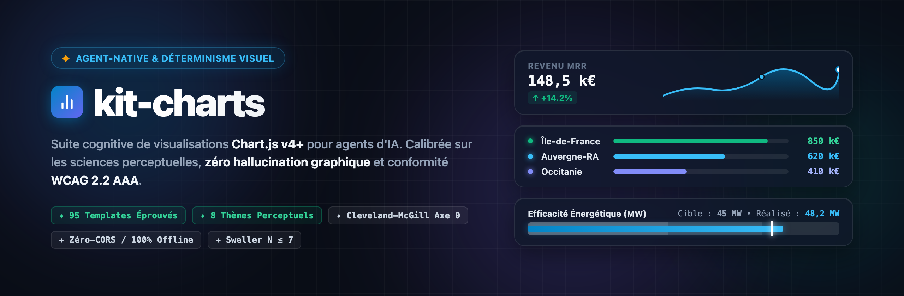

# kit-charts

Un kit de datavisualisation **agent-native** et **cognitivement déterministe** pour [Antigravity](https://github.com), [Claude Code](https://claude.com/claude-code), Cursor ou n'importe quel agent d'IA : il élimine les hallucinations graphiques et garantit un respect absolu des **sciences cognitives** (Cleveland-McGill, Tufte, Sweller, Mayer) et de l'accessibilité **WCAG 2.2 AAA**.

L'agent n'a **plus jamais à réinventer un graphique à partir de zéro** : il assemble des templates standardisés éprouvés et compile des visualisations prêtes à être ouvertes et inspectées instantanément dans votre navigateur.

---

## 🎯 Pourquoi ce kit ? La Philosophie du Déterminisme Visuel

Lorsqu'un modèle d'IA tente de coder un graphique à partir d'une feuille blanche, il commet fréquemment des erreurs psychophysiques majeures :
- **Troncature trompeuse des axes** (violation de la ligne de base $Y=0$, exagérant artificiellement des écarts minimes).
- **Surcharge de la mémoire de travail** (bar charts verticaux illisibles à 15 catégories ou spaghetti charts multi-lignes).
- **Discrimination chromatique désastreuse** (contrastes insuffisants, incompatibilité avec le daltonisme, fausses équivalences rouge/vert).
- **Code fragile et verbeux** difficile à maintenir et à intégrer.

**kit-charts** résout définitivement ce problème en introduisant un **déterminisme visuel complet** :

```
┌─────────────────────────────────────────────────────────────┐
│ 1. DATAVIZ-ARCHITECT (L'Architecte Décideur)                │
│    Analyse l'intention, choisit le template dans le         │
│    registre, qualifie le thème et la polarité métier,       │
│    et produit le contrat dataviz-spec.json.                 │
└──────────────────────────────┬──────────────────────────────┘
                               │ Contrat dataviz-spec.json
                               ▼
┌─────────────────────────────────────────────────────────────┐
│ 2. DATAVIZ-BUILDER (Le Constructeur / Exécuteur)            │
│    Consomme la spec, compile le template standardisé et     │
│    génère la page autonome dans output/<nom>/index.html.    │
└──────────────────────────────┬──────────────────────────────┘
                               │ Rendu HTML / JS autonome
                               ▼
┌─────────────────────────────────────────────────────────────┐
│ 3. DATAVIZ-REVIEWER (L'Auditeur Qualité & Linter)           │
│    Audite automatiquement les règles de garde cognitives    │
│    (Cleveland Axe 0, Sweller N<=7, WCAG AAA) et valide.     │
└─────────────────────────────────────────────────────────────┘
```

---

## 🚀 Démarrer en 3 Étapes

### 1. Cloner le Répertoire
```bash
git clone https://github.com/LouisLv-pro/kit-charts.git
cd kit-charts
```
*Zéro dépendance npm requise pour l'exécution au runtime.*

### 2. Explorer la Galerie Complète dans votre Navigateur
Ouvrez simplement [**`index.html`**](index.html) dans votre navigateur (double-clic ou `open index.html`).
- **100% Hors-Ligne & Zéro-CORS** : Tous les graphiques s'affichent instantanément sans avoir besoin d'un serveur HTTP local.
- **Interactivité en direct** : Testez les 8 thèmes perceptuels en un clic, activez/désactivez les étiquettes de données et explorez les 95 templates.

### 3. Demander à votre Agent de Créer un Graphique
Donnez simplement votre besoin métier à votre agent IA :

```text
"Génère un graphique comparant le chiffre d'affaires réalisé par région par rapport aux objectifs annuels, avec le thème Nord et des alertes visuelles claires."
```

L'agent sélectionne le template optimal (`bullet-chart`), applique les jetons de thème, compile le fichier dans `output/ventes-regions/index.html` et valide la conformité cognitive en moins de 50 ms.

---

## 👥 Ce que font les Agents du Kit

| Rôle Agent | Mission Principale | Livrable Produit |
| :--- | :--- | :--- |
| **`dataviz-architect`** | Analyse le besoin métier, sélectionne le template dans le registre, qualifie la polarité et le thème. | Contrat `dataviz-spec.json` |
| **`dataviz-builder`** | Compile le template sans coder ad-hoc via le script déterministe `compile-chart.js`. | Page `output/<projet>/index.html` + `spec.json` |
| **`dataviz-reviewer`** | Exécute l'audit `validate-chart.js` et vérifie l'absence absolue de régressions cognitives. | Rapport de conformité (100% Valide ou feedback correctif) |

---

## 📊 Les 10 Familles Analytiques (95 Templates Standardisés)

Chaque template est structuré en **triplet standardisé** (`template.html`, `schema.json`, `template.js`) :

| Famille | Exemples de Templates | Règle Cognitive Fondamentale |
| :--- | :--- | :--- |
| **00. Cartes KPI** | `kpi-standard`, `kpi-sparkline`, `kpi-bullet` | Valeur $\ge 24\text{px}$, police monospace tabulaire, delta explicite. |
| **01. Comparaison** | `bar-chart-vertical`, `bar-chart-horizontal`, `bullet-chart` | Ligne de base $Y=0$ absolue (`beginAtZero: true`), bascule horizontal si $N > 7$. |
| **02. Composition** | `doughnut-chart`, `stacked-bar-100`, `treemap` | Somme $= 100\%$, 2 à 5 tranches max, 0 3D, tri par surface décroissante. |
| **03. Distribution** | `box-plot`, `histogramme`, `density-plot` | 5 nombres de Tukey, moustaches à $1.5 \times \text{IQR}$, bins de Freedman-Diaconis. |
| **04. Corrélation** | `scatter-plot`, `bubble-chart`, `matrix-heatmap` | Ratio 1:1 (Cleveland), encodage taille par l'**aire** $\pi r^2$ et jamais par le rayon. |
| **05. Évolution Temporelle** | `line-chart`, `multi-line-chart`, `area-chart` | Temps de gauche à droite, max 5 courbes simultanées (anti-spaghetti). |
| **06. Flux & Processus** | `funnel-chart`, `waterfall-chart` | Décroissance ordonnée en entonnoir, piliers totaux distincts des incréments. |
| **07. Hiérarchies** | `sunburst`, `network-graph`, `radial-tree` | Profondeur $\le 3$ niveaux, densité d'arêtes maîtrisée. |
| **08. Cartographie** | `choropleth-map`, `bubble-map` | **Normalisation obligatoire** par habitant/taux (interdiction de totaux bruts surfaciques). |
| **09. Finance & Bourse** | `candlestick-chart`, `ohlc` | Conventions boursières (Vert = Hausse $Close > Open$, Rouge = Baisse). |
| **10. Tableaux Dataviz** | `table-sparklines`, `table-bar-in-cell` | Chiffres alignés à droite, barres miniatures intégrées. |

---

## 🎨 8 Thèmes Perceptuels & Sémantique de Valence Métier

Les palettes sont étalonnées sur les espaces uniformes **CIELAB / CAM02** pour garantir des contrastes $\ge 4.5:1$ (WCAG AA) et $\ge 7:1$ (WCAG AAA) :

1. **`colorbrewer-accessible`** (Défaut clair) : Palette éditoriale et universelle, sécurité daltonisme totale (CVD Safe).
2. **`viridis-perceptual`** : Luminance strictement monotone (lisible même imprimé en noir et blanc).
3. **`paul-tol-scientific`** : Calibré pour la recherche, discrimination maximale entre courbes.
4. **`tableau-stone-categorical`** : Palette corporate élégante aux teintes assourdies.
5. **`okabe-ito-cud`** : Standard japonais Color Universal Design (recommandé pour les publications officielles).
6. **`tufte-minimalist-executive`** : Noir, blanc et gris, une seule touche d'accentuation rouge (Data-Ink ratio maximal).
7. **`nord-cognitive-dark`** : Thème sombre anti-asthénopie (repos visuel pour salles de contrôle 24/7).
8. **`atkinson-hyperlegible`** : Conçu pour les personnes malvoyantes avec typographie à forte distinction de glyphes.

### Polarité Métier Déterministe
Ne supposez jamais qu'une hausse est toujours verte :
- **`HIGHER_IS_BETTER`** (CA, Marge, Rétention) : Hausse = Vert, Baisse = Rouge.
- **`LOWER_IS_BETTER`** (Churn, Pannes, Latence, Coûts) : Hausse = Rouge, Baisse = Vert.
- **`TARGET_BASED`** (SLA, Consommation) : Conforme = Vert, Tolérance = Orange, Dépassement = Rouge.
- **`NEUTRAL_CATEGORICAL`** (Pays, Départements) : Palette neutre sans connotation de performance.

---

## 🛠️ Commandes & Outillage CLI

```bash
# 1. Compiler un graphique depuis une spécification vers un sous-dossier propre
node .agents/skills/kit-charts/scripts/compile-chart.js dataviz-spec.json -o output/mon-graphique/index.html

# 2. Auditer la conformité cognitive et l'accessibilité d'un livrable
node .agents/skills/kit-charts/scripts/validate-chart.js output/mon-graphique/index.html --json

# 3. Recompiler le bundle UMD universel (95 templates)
npm run build

# 4. Lancer la suite complète de tests d'intégration E2E
npm test
```

---

## 📁 Structure du Projet

```
kit-charts/
├── index.html                        # Galerie vitrine interactive (100% hors-ligne, zéro-CORS)
├── catalog-bundle.js                 # Bundle UMD universel pré-compilé (95 templates)
├── package.json                      # Scripts et métadonnées du package
├── README.md                         # Ce guide
├── LICENSE                           # Licence open-source MIT
│
├── template/                         # 95 templates standardisés en triplets (HTML/JSON/JS)
│   ├── 00-kpi-card/                  # Cartes & Métriques synthétiques
│   ├── 01-comparaison/               # Barres, colonnes, bullet charts, lollipop
│   ├── 02-composition/               # Doughnut, waffle, treemap, stacked bar
│   ├── 03-distribution/              # Boxplot, histogramme, ridgeline, violon
│   ├── 04-correlation/               # Scatter, bulle, heatmap matricielle
│   ├── 05-evolution-temporelle/      # Courbes, aires, step-line, multi-lignes
│   ├── 06-flux-processus/            # Entonnoirs de conversion, waterfalls
│   ├── 07-hierarchie-reseau/         # Sunburst, graphes de réseau, dendrogrammes
│   ├── 08-geospatial-cartes/         # Cartes choroplèthes, cartes à bulles
│   ├── 09-financiere-bourse/         # Candlesticks, OHLC, bandes de volatilité
│   ├── 10-tableaux-matrices/         # Tableaux dataviz, sparklines intégrées
│   ├── tooltip/                      # Laboratoire d'infobulles anti-occlusion
│   └── animation/                    # Catalogue des 20 patterns cinématiques
│
├── themes/                           # Système des 8 thèmes & tokens chromatiques
│   ├── theme-tokens.js               # Moteur central de tokens, contrastes & plugins
│   └── 01-colorbrewer-accessible/ ... # Dossiers individuels des thèmes
│
├── output/                           # Dossier de sortie isolé pour les graphiques générés
│
└── .agents/                          # Intelligence & Orchestration Agentique
    ├── agents/                       # Prompts et rôles (Architect, Builder, Reviewer)
    ├── rules/                        # Garde-fous et règles cognitives non-négociables
    └── skills/kit-charts/            # Skill Antigravity, registre et scripts CLI
```

---

## 📜 Licence

Distribué sous licence **MIT**. Libre d'utilisation pour vos projets personnels, professionnels et vos agents d'IA.
