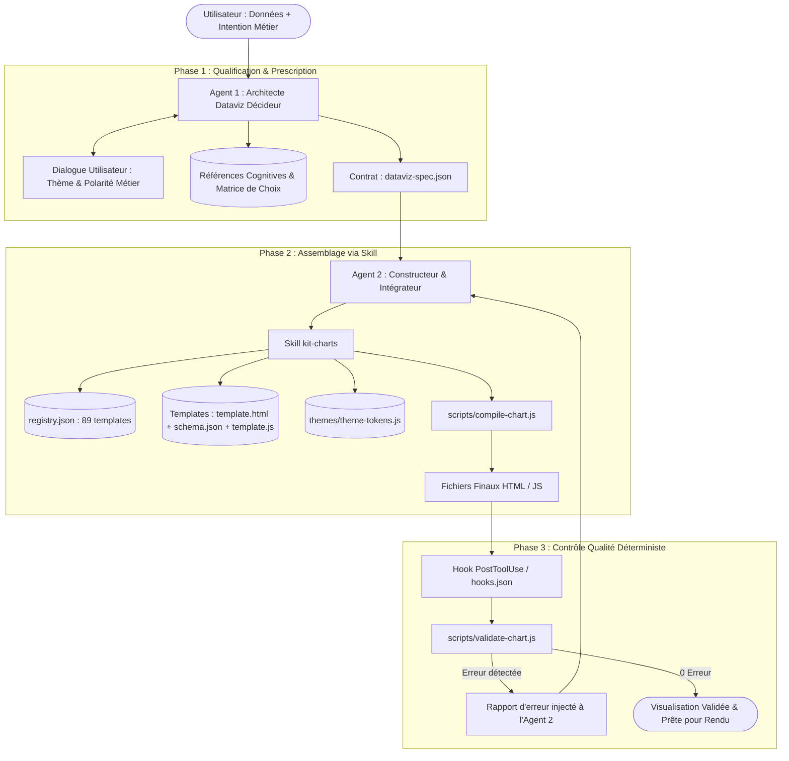

# 📋 Spécification Technique & Fonctionnelle — Kit-Charts Agent-Native

> **Version** : 1.0.0  
> **Statut** : Validé pour implémentation  
> **Dépôt** : `kit-charts`  

---

## 1. Ce que nous voulons accomplir (Synthèse Exécutive)

L'objectif de ce projet est de transformer la bibliothèque **kit-charts** (qui contient 89 visualisations, tableaux, animations et infobulles optimisés pour les sciences cognitives) en une **infrastructure native pour agents IA**, prête pour une diffusion open-source propre sur GitHub.

Concrètement, le système doit permettre à un utilisateur d'exprimer un besoin analytique ou de fournir des données brutes, et laisser une équipe de **deux agents spécialisés** collaborer de manière autonome, déterministe et sans erreur :

1. **L'Agent Architecte (Décideur)** analyse la situation, interroge l'utilisateur sur son thème visuel et la polarité de ses métriques (ex: est-ce qu'une hausse est une bonne ou une mauvaise nouvelle ?), sélectionne le graphique optimal selon les lois cognitives (Cleveland-McGill, Tufte, Gestalt), et formalise un contrat strict (`dataviz-spec.json`).
2. **L'Agent Constructeur (Exécuteur)** consomme cette spécification et déclenche un **Skill dédié (`kit-charts`)** qui assemble les templates (HTML/JSON/JS) et applique les tokens de couleur sans jamais manipuler de code arbitraire.
3. **Un Linter Automatisé via Hook** audite instantanément le code généré à la volée pour bloquer toute régression cognitive (ex: axe Y ne commençant pas à 0, surcharge de catégories, contraste WCAG insuffisant) et force l'agent à s'auto-corriger.
4. **Le Dépôt GitHub est assaini** : suppression des 80+ fichiers temporaires ou doublonnés (`scratch/`, `guide/`, `test/`, doublons HTML d'animation) pour offrir une arborescence minimale, élégante et directement installable par des humains ou des agents IA.

---

## 2. Architecture Globale du Système



---

## 3. Spécification des Rôles & Prompts des Deux Agents

### 3.1 Agent 1 : L'Architecte Dataviz (`dataviz-architect`)

* **Mission** : Résoudre l'équation cognitive (Objectif + Données $\rightarrow$ Visualisation + Thème + Valence + Animation).
* **Entrées** : Données brutes de l'utilisateur, intention analytique, contexte d'usage.
* **Protocole de Décision** :
  1. **Structure des Données** : Compter le nombre de catégories ($N$), de séries, identifier la nature des variables (continues, temporelles, hiérarchiques, géospatiales).
  2. **Interrogation / Validation du Thème** :
     - Proposer ou demander le thème de couleur (`colorbrewer-accessible`, `nord-cognitive-dark`, `dracula-vibrant-dark`, `okabe-ito-cud`, `tableau-stone-categorical`, etc.).
  3. **Polarité Métier & Valence** :
     - Qualifier la sémantique de la métrique :
       - `HIGHER_IS_BETTER` (ex: Chiffre d'affaires, Marge, Rétention) $\rightarrow$ Hausse = Vert, Baisse = Rouge.
       - `LOWER_IS_BETTER` (ex: Churn, Coûts, Latence, Pannes) $\rightarrow$ Hausse = Rouge, Baisse = Vert.
       - `TARGET_BASED` / `TOLERANCE_BAND` (ex: SLA, Température) $\rightarrow$ Conforme = Vert, Alerte = Orange, Hors seuil = Rouge.
       - `NEUTRAL_CATEGORICAL` (ex: Répartition par pays) $\rightarrow$ Palette discrète sans connotation de jugement.
  4. **Choix des Couches Secondaires** :
     - *Datalabels* : OUI si $N \le 7$ ou valeurs clés ; NON si risque d'encombrement perceptif ($N > 12$).
     - *Tooltips* : Toujours avec algorithme anti-occlusion (Mayer) et typographie tabulaire.
     - *Animations* : Sélection du motif cognitif adapté (ex: `01-staged-transitions` pour filtrage, `10-count-up` pour KPI, `09-path-drawing` pour série temporelle).
* **Sortie Contractuelle** : Fichier `dataviz-spec.json`.

#### Structure du Contrat `dataviz-spec.json`
```json
{
  "$schema": "http://json-schema.org/draft-07/schema#",
  "targetTemplateId": "bar-chart-vertical",
  "layout": {
    "title": "Chiffre d'Affaires par Filiale (2024)",
    "subtitle": "En millions d'euros (€) — Écart vs Objectif budgétaire",
    "height": 400
  },
  "colorStrategy": {
    "themeName": "colorbrewer-accessible",
    "mode": "semantic-valence",
    "metricPolarity": "HIGHER_IS_BETTER",
    "thresholds": {
      "target": 300,
      "warning": 200
    },
    "mappingRules": {
      "val >= target": "semantic.positive",
      "val >= warning": "semantic.warning",
      "val < warning": "semantic.negative"
    }
  },
  "cognitiveFeatures": {
    "showDataLabels": true,
    "tooltip": { "enabled": true, "antiOcclusion": true },
    "animation": { "patternId": "01-staged-transitions", "durationMs": 600 },
    "emphasis": { "highlightIndex": 0, "rationale": "Filiale leader" }
  },
  "formattedData": {
    "labels": ["France", "Allemagne", "Italie", "Espagne"],
    "datasets": [{
      "label": "CA (M€)",
      "data": [450, 380, 210, 190]
    }]
  }
}
```

---

### 3.2 Agent 2 : Le Constructeur & Intégrateur (`dataviz-builder`)

* **Mission** : Exécuter le skill `kit-charts` pour générer le code final sans jamais inventer de structure.
* **Entrées** : Le fichier `dataviz-spec.json`.
* **Protocole d'Exécution** :
  1. Lire `registry.json` pour localiser le triplet de fichiers du template demandé.
  2. Valider la conformité des données avec le `schema.json` du template.
  3. Lancer le compilateur `compile-chart.js` qui fusionne le fragment DOM `template.html`, la logique `template.js` et les tokens de `theme-tokens.js`.
  4. Sauvegarder le code résultant.

---

## 4. Standardisation des Templates (Triplets)

Chaque motif parmi les 89 visualisations du dossier `template/` est harmonisé selon la structure suivante :

```
template/<famille>/<motif>/
├── template.html      # Conteneur DOM avec placeholders {{TITLE}}, {{CANVAS_ID}}, etc.
├── schema.json        # Schéma JSON des données acceptées et des contraintes d'usage
├── template.js        # Module UMD autonome de rendu Chart.js
└── preview.html       # Visualiseur de démonstration local (Zero-CORS)
```

---

## 5. Le Registre Machine-Readable (`registry.json`)

Situé dans `.agents/skills/kit-charts/registry.json`, ce manifeste permet aux agents d'interroger la bibliothèque de manière déterministe :

```json
{
  "version": "1.0.0",
  "totalTemplates": 89,
  "templates": [
    {
      "id": "bar-chart-vertical",
      "family": "01-comparaison",
      "name": "Diagramme en Barres Verticales",
      "description": "Comparaison de valeurs discrètes avec labels courts (≤ 7 catégories).",
      "dataRequirements": {
        "labelsType": "categorical",
        "minCategories": 1,
        "maxCategories": 7,
        "seriesCount": 1
      },
      "supportedFeatures": {
        "dataLabels": true,
        "antiOcclusionTooltip": true,
        "semanticValence": true,
        "compatibleAnimations": ["01-staged-transitions", "05-mot-stagger", "17-series-buildup"]
      },
      "paths": {
        "html": "template/01-comparaison/bar-chart-vertical/template.html",
        "schema": "template/01-comparaison/bar-chart-vertical/schema.json",
        "js": "template/01-comparaison/bar-chart-vertical/template.js",
        "preview": "template/01-comparaison/bar-chart-vertical/preview.html"
      }
    }
  ]
}
```

---

## 6. Le Linter Déterministe & Système de Hooks

### 6.1 Règles Contrôlées par `scripts/validate-chart.js`

1. **Règles d'Échelle & Géométrie (Cleveland & McGill)** :
   - Graphiques de longueur (bar, column, lollipop, bullet) : `scales.y.beginAtZero === true` obligatoire.
   - Échelles logarithmiques : Interdites sur bar charts.
2. **Règles de Charge Cognitive (Sweller / Miller)** :
   - `bar-chart-vertical` : Erreur si $N > 7$ (doit basculer en `bar-chart-horizontal`).
   - `multi-line-chart` : Erreur si $> 5$ lignes simultanées.
   - `dataLabels` : Désactivés si $N > 12$ points.
3. **Accessibilité & WCAG 2.2** :
   - Contraste texte/fond $\ge 4.5:1$ (validé contre le thème).
   - Présence de la garde `prefers-reduced-motion` ($\Delta T = 0\text{ ms}$).
   - Durée d'animation $\le 800\text{ ms}$.
   - Interdiction stricte de rebonds décoratifs (`bounce`, `elastic`).

### 6.2 Configuration du Hook (`.agents/hooks.json`)

```json
{
  "dataviz-quality-gate": {
    "enabled": true,
    "PostToolUse": [
      {
        "matcher": "write_to_file|replace_file_content",
        "hooks": [
          {
            "type": "command",
            "command": "node .agents/skills/kit-charts/scripts/validate-hook.js",
            "timeout": 5
          }
        ]
      }
    ]
  }
}
```

---

## 7. Plan de Restructuration & Nettoyage du Dépôt

### 7.1 Actions de Nettoyage Immédiates
- 🗑️ **Suppression de `scratch/`** (30 scripts internes obsolètes).
- 🗑️ **Suppression de `template/template/`** (dossier résiduel fantôme).
- 🗑️ **Suppression des 20 fichiers `template/animation/*.html`** (doublons des sous-dossiers `01-` à `20-`).
- 🗑️ **Suppression de `implementation-animation.md`** (spécification de travail transitoire).
- 📦 **Migration de `guide/` vers `.agents/skills/kit-charts/references/`** : la documentation théorique devient la base de connaissances native des agents.
- 📦 **Consolidation de `test/` dans `scripts/validate-chart.js`** : remplacement des 35 scripts de test par le linter unifié et exécutable en 50ms.

### 7.2 Arborescence Finale Cible

```
kit-charts/
├── .agents/
│   ├── hooks.json                    # Hook de validation automatique PostToolUse
│   ├── rules/
│   │   └── dataviz-rules.md          # Règles de garde cognitives obligatoires
│   └── skills/
│       └── kit-charts/               # Le Skill autonome
│           ├── SKILL.md              # Instructions, API et workflows d'invocation
│           ├── registry.json         # Manifeste machine-readable des 89 templates
│           ├── scripts/              # Outils déterministes
│           │   ├── compile-chart.js  # Compilateur DOM/JS
│           │   ├── validate-chart.js # Linter cognitif & WCAG
│           │   └── validate-hook.js  # Pont pour le hook Antigravity
│           └── references/           # Guides cognitifs (migrés depuis guide/)
│               ├── cognitive-rules.md
│               ├── decision-matrix.md
│               └── color-semantics.md
├── template/                         # 89 triplets standardisés (zéro doublon)
│   ├── 00-kpi-card/
│   ├── 01-comparaison/
│   ├── 02-composition-part-to-whole/
│   ├── 03-distribution/
│   ├── 04-correlation-relation/
│   ├── 05-evolution-temporelle/
│   ├── 06-flux-processus/
│   ├── 07-hierarchie-reseau/
│   ├── 08-geospatial-cartes/
│   ├── 09-tableaux-dataviz/
│   ├── animation/                    # 20 dossiers propres (01- à 20-)
│   └── tooltip/
├── themes/                           # Design System & Tokens accessibles
│   ├── theme-tokens.js
│   └── stat-helpers.js
├── catalog-bundle.js                 # Bundle UMD universel
├── index.html                        # Showcase interactif et galerie
├── package.json                      # Manifeste de publication npm / GitHub
├── LICENSE                           # Licence MIT
├── SPECIFICATION.md                  # Ce document de référence
└── README.md                         # Documentation publique d'installation et d'usage
```

---

## 8. Définition du Fini (Definition of Done — DoD)

Le projet sera considéré comme **100% terminé** lorsque l'ensemble des critères suivants seront validés :

- [ ] **Propreté du Dépôt** :
  - Les dossiers `scratch/`, `guide/`, `test/`, `template/template/` et les 20 fichiers `template/animation/*.html` sont supprimés.
  - La racine ne contient que les fichiers essentiels (`README.md`, `SPECIFICATION.md`, `package.json`, `index.html`, `catalog-bundle.js`, `LICENSE`, `template/`, `themes/`, `.agents/`).
- [ ] **Standardisation des Templates** :
  - Les 89 visualisations disposent d'un `template.html`, `schema.json` et `template.js` valides et cohérents.
- [ ] **Catalogue Machine-Readable** :
  - Le fichier `.agents/skills/kit-charts/registry.json` est complet, valide syntaxiquement et référence l'intégralité des 89 templates avec leurs métadonnées cognitives et contraintes de dimensions.
- [ ] **Moteur de Thème & Valence** :
  - Les 12+ thèmes de `theme-tokens.js` sont pilotables par configuration, et la logique de polarité (`HIGHER_IS_BETTER`, `LOWER_IS_BETTER`, `TARGET_BASED`) est documentée et testée.
- [ ] **Linter & Hooks Opérationnels** :
  - Le script `scripts/validate-chart.js` s'exécute en `< 100ms` et intercepte avec succès les violations d'Axe 0, de surcharge de catégories et d'accessibilité.
  - Le fichier `.agents/hooks.json` déclenche automatiquement l'audit lors de l'écriture d'un graphique.
- [ ] **Documentation du Skill & Agents** :
  - Le fichier `.agents/skills/kit-charts/SKILL.md` est rédigé selon les standards Antigravity avec description précise, workflows et progressive disclosure.
- [ ] **Validation Démonstrateur E2E** :
  - Un test de bout en bout complet (Simulation Prompt Utilisateur $\rightarrow$ `dataviz-spec.json` $\rightarrow$ Compilation $\rightarrow$ Hook Linting $\rightarrow$ Rendu HTML autonome) fonctionne sans aucune intervention manuelle.
